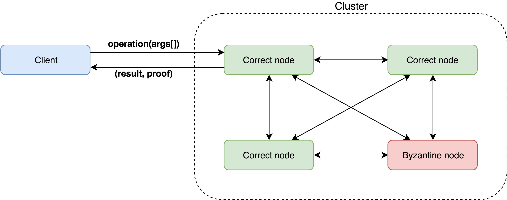
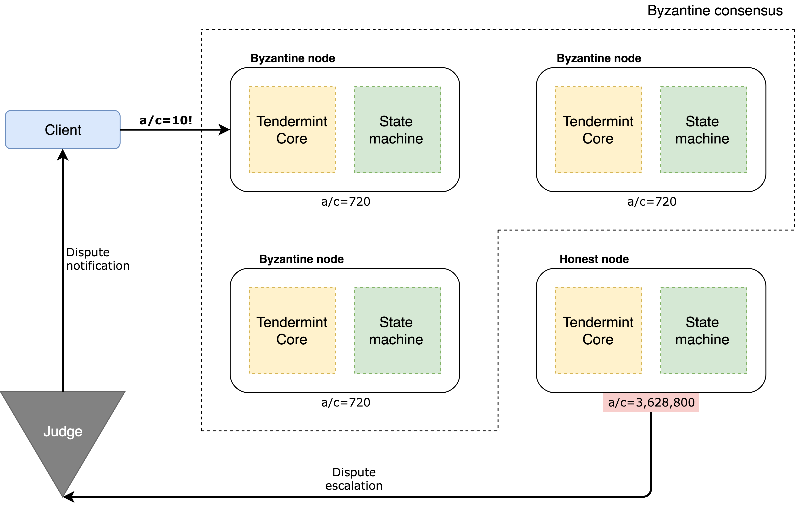
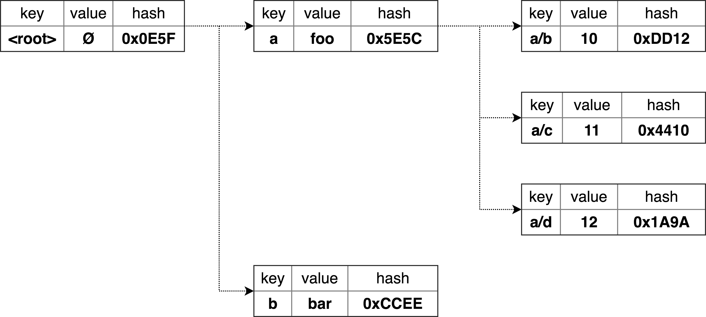
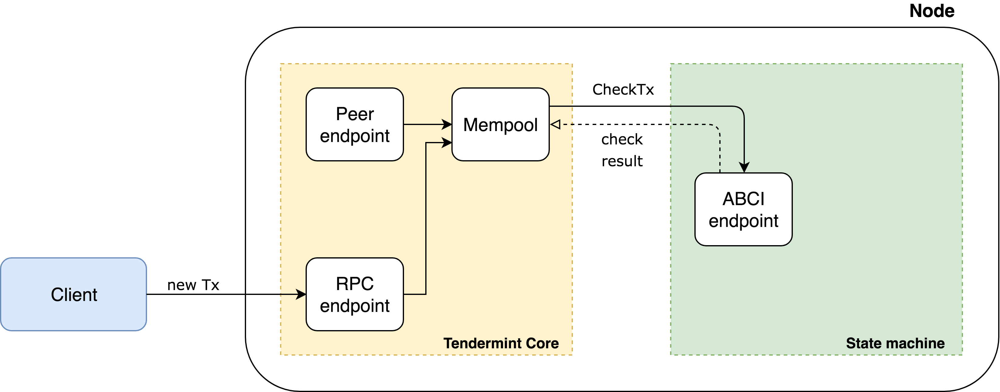
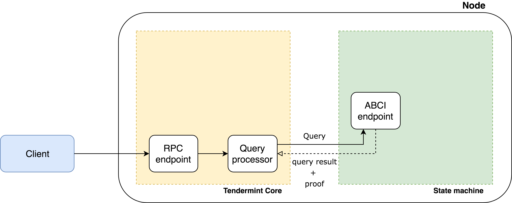
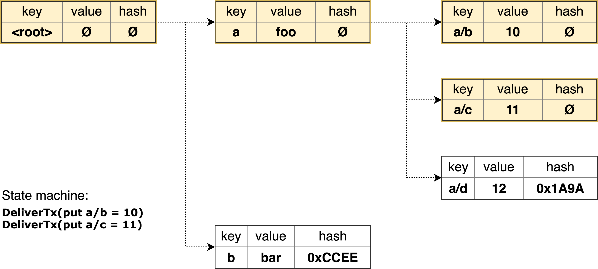
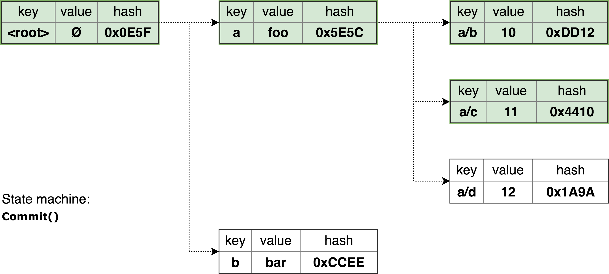

# Tendermint Verifiable Computations and Storage Demo

This demo application shows how verifiable computations might be processed by a distributed cluster of nodes. It comes with a set of hardcoded operations that can be invoked by the client. Each requested operation is computed by every (ignoring failures or Byzantine cases) cluster node, and if any node disagrees with the computation outcome it can submit a dispute to an external Judge.

Results of each computation are stored on the cluster nodes and can be later on retrieved by the client. The storage of the results is secured with Merkle proofs, so malicious nodes can't substitute them with bogus data.

Because every computation is verified by the cluster nodes and computation outcomes are verified using Merkle proofs, the client normally doesn't have to interact with the entire cluster. Moreover, the client can interact with as little as a single node – this won't change safety properties. However, liveness might be compromised – for example, if the node the client is interacting with is silently dropping incoming requests.

<p align="center">

</p>

## Table of contents
* [Motivation](#motivation)
* [Overview](#overview)	
	* [State machine](#state-machine)
	* [Computations correctness](#computations-correctness)
	* [Tendermint](#tendermint)
	* [Operations](#operations)
* [Installation and run](#installation-and-run)
* [Command-line interface](#command-line-interface)
	* [Effectful operations (`put`)](#effectful-operations-put)
	* [Querying operations (`get, ls`)](#querying-operations-get-ls)
	* [Compute operations (`run`)](#compute-operations-run)
	* [Verbose mode and proofs](#verbose-mode-and-proofs)
* [Implementation details](#implementation-details)
	* [Operations processing](#operations-processing)
	* [Few notes on transactions processing](#few-notes-on-transactions-processing)
	* [Few notes on ABCI queries processing](#few-notes-on-abci-queries-processing)
	* [Client implementation details](#client-implementation-details)
	* [Transactions and Merkle hashes](#transactions-and-merkle-hashes)
* [Problematic situations review ](#problematic-situations-review)
	* [A. Cases which the client can detect and handle](#a-cases-which-the-client-can-detect-and-handle)
	* [B. Cases which the client can detect, but cannot handle](#b-cases-which-the-client-can-detect-but-cannot-handle)
	* [C. Dispute cases](#c-dispute-cases)
		* [C1. Some nodes correct, some not, no quorum](#dispute-case-c1-some-nodes-correct-some-not-no-quorum)
		* [C2. Byzantine quorum, minority of correct nodes](#dispute-case-c2-byzantine-quorum-minority-of-correct-nodes)
		* [C3. Correct quorum, some nodes Byzantine or not available](#dispute-case-c3-correct-quorum-some-nodes-byzantine-or-not-available)

## Motivation
The application is a proof-of-concept of a decentralized system with the following properties:
* Support of arbitrary deterministic operations: simple reads or writes as well as complex computations.
* Total safety of operations when more than 2/3 of the cluster is non-Byzantine.
* Ability to notice and dispute an incorrect behavior when there is at least one non-Byzantine node.
* High availability: tolerance to simultaneous failures or Byzantine actions of some subset of nodes.
* High throughput (up to 1000 transactions per second) and low latency (&#126;1-2 seconds) of operations.
* Reasonable blockchain finality time (few seconds).

## Overview
There are following actors in the application network:

* Cluster **nodes** which carry certain *state* and can run computations over it following requests sent by the client. All nodes normally have an identical state – the only exception is when some node is faulty, acting maliciously or has network issues. Computations can be *effectful* – which means they can change the state.

  When the cluster has reached *consensus* on the computation outcome, the new state can be queried by the client – any up-to-date node can serve it. Consensus requires a 2/3 majority of the nodes to agree to avoid Byzantine nodes sneaking in incorrect results.

* The **client** which can issue simple requests like `put` or `get` to update the cluster state as well as run complex computations. In this demo application an available computations set is limited to operations like `sum` or `factorial` but in principle can be extended by a developer.

  The client is able to check whether the cluster has reached consensus over computation outcomes by checking cluster nodes signatures and validate responses to the queries using Merkle proofs. This means that unless the cluster is taken over by Byzantine nodes the client can be certain about results provided and in general about the cluster state.

* The **Judge** which is in charge of resolving disputes over computations outcomes. Different nodes in the cluster might have different opinions on how their state should change when the computation is performed. Unless there is an unanimous consensus, any disagreeing node can escalate to the **Judge** for the final determination and penalization of uncomplying nodes.

  The **Judge** is not represented by a single machine – actually, it can be as large as Ethereum blockchain to have the desired trustworthiness properties. For this showcase, however, it is imitated as a single process stub which can only notify the user if there is any disagreement.

Two major logical parts can be marked out in the demo application. One is a BFT consensus engine with a replicated transaction log which is provided by the Tendermint platform (**Tendermint Core**). Another is a state machine with domain-specific state transitions induced by transactions. Each node in the cluster runs an Tendermint Core instance and a state machine instance, and Tendermint connects nodes together. We will discuss both parts in more details below.

<p align="center">

</p>

Demo application operates under the following set of assumptions:
* the set of nodes in the cluster is immutable
* public keys of cluster nodes are known to all network participants
* the Judge is trustworthy
* honest nodes can communicate with the client and the Judge

### State machine

Each node carries a state which is updated using transactions furnished through the consensus engine. Assuming that more than 2/3 of the cluster nodes are honest, the BFT consensus engine guarantees *correctness* of state transitions. In other words, unless 1/3 or more of the cluster nodes are Byzantine there is no way the cluster will allow an incorrect transition. 

If every transition made since the genesis was correct, we can expect that the state itself is correct too. Results obtained by querying such a state should be correct as well (assuming a state is a verifiable data structure). However, if at any moment in time there was an incorrect transition, all subsequent states can potentially be incorrect even if all later transitions were correct.

<p align="center">

</p>

In this demo application the state is implemented as an hierarchical key-value tree which is combined with a Merkle tree. This allows a client that has obtained a correct Merkle root from a trusted location to query a single, potentially malicious, cluster node and validate results using Merkle proofs.

Such trusted location is provided by the Tendermint consensus engine. Cluster nodes reach consensus not only over the canonical order of transactions, but also over the Merkle root of the state – `app_hash` in Tendermint terminology. The client can obtain such Merkle root from any node in the cluster, verify cluster nodes signatures and check that more than 2/3 of the nodes have accepted the Merkle root change – i.e. that consensus was reached.

<p align="center">

</p>

### Computations correctness

It's not possible to expect that a cluster can't be taken over by Byzantine nodes. Let's assume that `n` nodes in the cluster were independently sampled from a large enough pool of the nodes containing a fraction of `q` Byzantine nodes. In this case the number of Byzantine nodes in the cluster (denoted by `X`) approximately follows a Binomial distribution `B(n, q)`. The probability of the cluster failing BFT assumptions is `Pr(X >= ceil(1/3 * n))` which for 10 cluster nodes and 20% of Byzantine nodes in the network pool is `~0.1`.

This a pretty high probability, and if we want to keep the cluster size reasonably low to have desired cost efficiency another trick should work. We can allow any node in the cluster to escalate to the external trusted **Judge** if it disagrees with state transitions made by the rest of the nodes. In this case, all nodes in the cluster need to be Byzantine to keep the **Judge** uninformed. For the considered case the probability of such event is `~1E-7`.

This way it's possible to improve the probability of noticing an incorrect behavior almost by six orders of magnitude. However, there is a significant difference between the two approaches. Once the cluster has reached consensus, the state transition is made and potentially incorrect results can be immediately used by the client. An escalation mechanism allows to notice an incorrect cluster behavior only *post factum*.

To compensate, a **Judge** can penalize malicious nodes by forfeiting their security deposits for the benefit of the client. However, even in this case a client can't be a mission critical application where no amount of compensation would offset the damage made.

### Tendermint

[Tendermint](https://github.com/tendermint/tendermint) platform provides a Byzantine-resistant consensus engine (**Tendermint Core**) which roughly consists of the following parts:
* distributed transaction cache (**mempool**)
* blockchain to store transactions
* Byzantine-resistant **сonsensus** module (to reach the agreement on the order of transactions)
* peer-to-peer layer to communicate with other nodes
* **RPC endpoint** to serve client requests
* **query processor** for making requests to the state

To execute domain-specific logic the application state machine implements Tendermint's [ABCI interface](http://tendermint.readthedocs.io/projects/tools/en/master/abci-spec.html). It is written in `Scala 2.12`, compatible with `Tendermint v0.19.x` and uses the [`jabci`](https://mvnrepository.com/artifact/com.github.jtendermint/jabci) library providing ABCI definitions for JVM languages.

Tendermint orders incoming transactions, passes them to the application and stores them persistently. It also combines transactions into ordered lists – _blocks_. Besides the transaction list, a block also has some [metadata](http://tendermint.readthedocs.io/en/master/specification/block-structure.html) that helps to provide integrity and verifiability guarantees. Basically this metadata consists of two major parts:
* metadata related to the current block
	* `height` – an index of this block in the blockchain
	* block creation time
	* hash of the transaction list in the block
	* hash of the previous block
* metadata related to the previous block
	* `app_hash` – hash of the state machine state that was achieved at the end of the previous block
	* previous block *voting process* information

<p align="center">

</p>

To create a new block a single node – the block _proposer_ is chosen. The proposer composes the transaction list, prepares the metadata and initiates the [voting process](http://tendermint.readthedocs.io/en/master/introduction.html#consensus-overview). Then other nodes make votes accepting or declining the proposed block. If enough number of votes accepting the block exists (i.e. the _quorum_ was achieved – more than 2/3 of the nodes in the cluster voted positively), the block is considered committed. 

Once this happens, every node's state machine applies newly committed block transactions to the state in the same order those transactions are present in the block. Once all block transactions are applied, the new state machine `app_hash` is memorized by the node and will be used in the next block formation. 

If for some reason a quorum was not reached the proposer is changed and a new _round_ of a block creation for the same `height` as was in the previous attempt is started. This might happen, for example, if there was an invalid proposer, or a proposal containing incorrect hashes, a timed out voting and so on.

Note that the information about the voting process and the `app_hash` achieved during the block processing by the state machine are not stored in the current block. The reason is that this part of metadata is not known to the proposer at time of block creation and becomes available only after successful voting. That's why the `app_hash` and voting information for the current block are stored in the next block. That metadata can be received by external clients only upon the next block commit event.

Grouping transactions together significantly improves performance by reducing the storage and computational overhead per transaction. All metadata including `app_state` and nodes signatures is associated with blocks, not transactions.

It's important to mention that block `height` is a primary identifier of a specific state version. All non-transactional queries to the state machine (e.g. `get` operations) refer to a particular `height`. Also, some blocks might be empty – contain zero transactions. By committing empty blocks, Tendermint maintains the freshness of the state without creating dummy transactions.

Another critical thing to keep in mind is that once the `k` block is committed, only the presence and the order of its transactions is verified, but not the state achieved by their execution. Because the `app_hash` resulted from the block `k` execution is only available when the block `k + 1` is committed, the client has to wait for the next block to trust a result computed by the transaction in the block `k`. To avoid making the client wait if there were no transactions for a while, Tendermint makes the next block (possibly empty) in a short time after the previous block was committed.

### Operations
There are few different operations that can be invoked using the bundled command-line client: 
* `put` operations which request to assign a constant value to the key: `put a/b=10`.
* computational `put` operations which request to assign the function result to the key: `put a/c=factorial(a/b)`
* `get` operations which read the value associated with a specified key: `get a/b`

`put` operations are _effectful_ and are explicitly changing the application state. To process such operation, Tendermint sends a transaction to the state machine which applies this transaction to its state, typically changing the associated value of the specified key. If requested operation is a computational `put`, state machine finds the corresponding function from a set of previously hardcoded ones, executes it and then assigns the result to the target key. 

Correctness of `put` operations can be verified by the presence of a corresponding transaction in a correctly formed block and an undisputed `app_hash` in the next block. Basically, this would mean that a cluster has reached quorum regarding this transaction processing. 

`get` operations do not change the application state and are implemented as Tendermint _ABCI queries_. As the result of such query the state machine returns the value associated with the requested key. Correctness of `get` operations can be verified by matching the Merkle proof of the returned result with the `app_hash` confirmed by consensus.

## Installation and run
To run the application, the node machine needs Scala 2.12 with `sbt`, [Tendermint](http://tendermint.readthedocs.io/en/master/install.html) binary and  GNU `screen` in the PATH.  
To execute operations the client machine needs Python 2.7 with `sha3` package installed.

This demo contains scripts that automate running a cluster of 4 nodes (the smallest BFT ensemble possible) on the local machine. To prepare configuration files, run `tools/local-cluster-init.sh`. This will create a directory `$HOME/.tendermint/cluster4` containing Tendermint configuration and data files.

To start the cluster, run `tools/local-cluster-start.sh` which starts 9 `screen` instances: `app[1-4]` – application backends, `tm[1-4]` – corresponding Tendermint instances and `judge` – Judge stub. Cluster initialization might take few seconds.

Other scripts allow to temporarily stop (`tools/local-cluster-stop.sh`), delete (`tools/local-cluster-delete.sh`) and reinitialize & restart (`tools/local-cluster-reset.sh`) the cluster.

## Command-line interface
Examples below use `localhost:46157` to connect to the 1st local "node". To access other nodes it's possible to use other endpoints (`46257`, `46357`, `46457`). Assuming Byzantine nodes don't silently drop incoming requests, all endpoints behave the same way. To deal with such nodes client could have been sending the same request to multiple nodes at once, but this is not implemented yet.

### Effectful operations (`put`)
To order the cluster to assign a value to the target key, issue:
```bash
> python cli/query.py localhost:46157 put a/b=10
```

To order the cluster to compute a function result and assign it to the target key, run:
```bash
> python cli/query.py localhost:46157 put "a/c=factorial(a/b)"
```

Note that `put` operations do not return any result – they merely instruct Tendermint to add a corresponding transaction to the mempool. An actual transaction execution and state update might happen a bit later, when a new block is formed, accepted by consensus and processed by state machines. It's validation happens even later when the consensus is reached on the next block.

There are few other operations bundled with the demo applicaton:

```bash
# a trick to copy a value from one key to the target key
> python cli/query.py localhost:46157 put "a/d=copy(a/b)"

# increment the value in-place and associate it's old version with the target key
> python cli/query.py localhost:46157 put "a/e=increment(a/d)"

# compute the sum and assign it to the target key
> python cli/query.py localhost:46157 put "a/f=sum(a/d,a/e)"

# compute a hierachical sum of values associated with the key and it's descendants
> python cli/query.py localhost:46157 put "c/a_sum=hiersum(a)"
```

### Querying operations (`get`, `ls`)
To read the value associated with the key, run:
```bash
> python cli/query.py localhost:46157 get a/b
10

> python cli/query.py localhost:46157 get a/c
3628800

> python cli/query.py localhost:46157 get a/d
11

> python cli/query.py localhost:46157 get a/e
10

> python cli/query.py localhost:46157 get a/f
21

> python cli/query.py localhost:46157 get c/a_sum
3628852
```

To list immediate children for the key, issue:
```bash
> python cli/query.py localhost:46157 ls a
e f b c d
```

### Verbose mode and proofs
Verbose mode allows to obtain a little bit more information on how the Tendermint blockchain structure looks like and how the client performs verifications.

**Let's start with `put` operation:**
```bash
> python cli/query.py localhost:46157 put -v root/x=5
height:    7

# wait for few seconds

> python cli/query.py localhost:46157 put -v "root/x_fact=factorial(root/x)"
height:    9
```
In this example, `height` corresponds to the height of the block in which the `put` transaction eventually got included. Now, we can checkout blockchain contents using a `parse_chain.py` script:
```bash
> python cli/parse_chain.py localhost:46157
height                 block time     txs acc.txs app_hash                            tx1
...
    7: 2018-06-26 14:35:02.333653       1       3 0xA981CC                       root/x=5
    8: 2018-06-26 14:35:03.339486       0       3 0x214F37
    9: 2018-06-26 14:35:36.698340       1       4 0x214F37  root/x_fact=factorial(root/x)
   10: 2018-06-26 14:35:37.706811       0       4 0x153A5D
```
This script shows latest blocks in the blockchain with a short summary on their transactions. For example, it's possible to see that provided transaction `root/x=5` was indeed included in the block with height `7`. This means that Tendermint majority (more than 2/3 of the cluster nodes) agreed on including this transaction in this block, and that was certified by their signatures.

It's also possible to see that `app_hash` is modified only in the block following the block with transactions. You could note that block 8 (empty) and block 9 (containing `root/x_fact=factorial(root/x)`) application hashes are the same. However, block 10 has the application hash changed which corresponds to the changes that transactions from the previous block introduced into the application state.

**Now let's pull results back using `get` operation:**
```bash
> python cli/query.py localhost:46157 get -v root/x
height:    9
app_hash:  0x153A5D
5

> python cli/query.py localhost:46157 get -v root/x_fact
height:    9
app_hash:  0x153A5D
120
```
Here we can see that both (correct!) results correspond to the latest `app_hash` – `0x153A5D`.

## Implementation details

### Operations processing
To perform operations, a client normally connects to a single node of the cluster.

Querying requests such as `get` are processed entirely by a single node. Single node state machine has all the required data to process queries because the state is fully replicated. The blockchain is fully replicated as well and each block contains signatures of the nodes accepted it, so the client can verify that the `app_hash` return by the node is not a bogus one.

Processing effectful requests such as `put` requires multiple nodes to reach consensus, however the client still sends a transaction to a single node. Tendermint is responsible in spreading this transaction to other nodes and reaching consensus.

**Note: potential issues**  
It's possible that a malicious node might silently drop incoming transactions so they will never get propagated over the cluster. The client could monitor the blockchain to see if transaction got finally included in an accepted block, and if it didn't – resend it to other nodes.

It is also possible that a malicious node might use a stale state and stale blockchain to serve queries. In this case the client has no way of knowing that the cluster state has advanced. Two approaches can be used, however – the first is to send a `no-op` transaction and wait for it to appear in the selected node blockchain. Because including a transaction into the blockchain means including and processing all transactions before it, the client will have a guarantee that the state has advanced. Another approach is to query multiple nodes at once about their last block height and compare it to the last block height of the selected node.

### Few notes on transactions processing
A transaction is processed primarily by two Tendermint modules: mempool and consensus.

It appears in mempool once one of Tendermint [RPC](https://tendermint.readthedocs.io/projects/tools/en/master/specification/rpc.html) `broadcast` methods is invoked. After that the mempool invokes the application's `CheckTx` ABCI method. The application might reject the transaction if it's invalid, in which case the transaction is removed from the mempool and the node doesn't need to connect to other nodes. Otherwise Tendermint starts spreading transaction to other nodes.

<p align="center">

</p>

The transaction remains for some time in mempool until consensus module of the current Tendermint proposer consumes it, includes to the newly created block (possibly together with several other transactions) and initiates a voting process for this block. If the transaction rate is intensive enough or exceeds the node throughput, it is possible that the transaction might wait during few blocks formation before it is eventually consumed by proposer. Note that transaction broadcast and the block proposal are processed independently, so it is totally possible that the block proposer is not the node originally accepted and broadcaster the transaction.

If more than 2/3 of the cluster nodes voted for the proposal in a timely manner, the voting process ends successfully. In this case every Tendermint instance starts synchronizing the block with its local state machine. It consecutively invokes the state machine's ABCI methods: `BeginBlock`, `DeliverTx` (for each transaction), `EndBlock` and lastly, `Commit`. The state machine applies transactions in the order they are delivered, calculates the new `app_hash` and returns it to Tendermint Core. At that moment the block processing ends and the block becomes available to the outside world (via the RPC methods like `block` and `blockchain`). Tendermint keeps `app_hash` and the information about a voting process so it can include it into the next block metadata.

<p align="center">

</p>

### Few notes on ABCI queries processing
ABCI queries carry the target key and the target `height`. They are initially processed by the Tendermint query processor which reroutes them to the state machine.

State machine processes the query by looking up for the target key in a state corresponding to the block with specified `height`. This means that the state machine has to maintain several states (corresponding to different block heights) to be able to serve different queries.

<p align="center">

</p>

Note that state machine handles mempool (`CheckTx`), consensus (`DeliverTx`, `Commit`, etc) and queries pipelines concurrently. Because the target `height` is explicitly requested by queries, state machine maintains separate states for those pipelines. This way so serving queries is not affected when transactions are being concurrently delivered to the application.

### Transactions and Merkle hashes
State machine does not recalculate Merkle hashes during `DeliverTx` processing. Instead, the state machine modifies the tree and marks changed paths by clearing Merkle hashes until ABCI `Commit` method is invoked. This allegedly should improve performance when there are several transactions in the block.

<p align="center">

</p>

On `Commit` the State machine recalculates Merkle hash along changed paths only. Finally, the app returns the resulting root Merkle hash to TM Core and this hash is stored as `app_hash` for a corresponding block.

<p align="center">

</p>

Note that described merkelized structure is used just for demo purposes and is not self-balanced. It remains efficient only while transactions keep it relatively balanced. Something like [Patricia tree](https://github.com/ethereum/wiki/wiki/Patricia-Tree) or Merkle B-Tree should be more appropriate to achieve self-balancing.

## Problematic situations review 
There is a number of situations which might potentially go wrong with this demo application. Some of them are already handled by the client, some of them could have been handled but not supported yet, some could be detected but can't be handled without the external intervention. Below we will try to list a few, just keep in mind that list is not comprehensive by any means:

* A node might become unavailable because of the network issues, failing hardware or simply because the malicious node decided to start dropping requests. If this happens when the client is making requests, it can get noticed using timeouts. In this case the client simply retries the request, but now sends it to a different node. For the cluster it also doesn't create too many issues, because even with a fraction of unavailable nodes the cluster is able to reach consensus.

### Cases which the client can detect and handle
1. The node is not available (for example, RPC requests to it have timed out). In this case the client simply retries the request with another node: it's perfectly possible that the rest of the nodes is enough to have a quorum.
2. Node's Tendermint blockchain RPCs return an inconsistent information. For example, that might be incorrect block hashes, incorrect vote signatures or signatures that are not matched with known public keys. In this case, the Client treats the node as incorrect (possibly Byzantine) and retries request to another node. *Not implemented yet*.
3. The TM Core ABCI Query returns wrong result/proof combination (inconsistent with the target height's `app_hash`). Like for Case 2, in this case, the Client treats the node as incorrect (possibly Byzantine) and retries request to another node.
4. The TM Core blockchain RPCs return stale data. The Client expects some maximum time between the blocks, so observing the larger time since the latest block is the reason to retry the request to another node. Note that the current node cannot be considered Byzantine for sure because it might experience connection problems with the rest of the cluster. *Not implemented yet*.

### B. Cases which the client can detect, but cannot handle
After detecting those cases the Client is sure that the cluster **liveness** is violated. An external interference is required to restore it.
1. The Client retried the request for cases A1-A4 for all cluster nodes and they all are failed.
2. The cluster cannot commit `height+1`-th block while the Client waits for it to have `height`-th block verifiable. This is actually a subcase of the previous case, but it appears if the cluster recently committed `height`-th block during `put` or `run` processing. The failure to progress in this case probably means that the nodes have different `app_hash`-es for `height`-th block, so this is likely an evidence of the **dispute** in the cluster.

### C. Dispute cases
Dispute cases, in general, cannot be detected by the client, because the client is normally satisfied by the first successful response while retrying response to the cluster nodes. The external Judge is available to the correct nodes in order to prevent such situations (instead of multicasting the client requests to all cluster nodes and comparing the responses).

Another, even more important, reason is that the dispute case might violate the cluster **safety**! When there is a *Byzantine quorum*, Byzantine nodes might provide to the client as wrong responses as they want, but the client keeps trusting the cluster because no Cases B and even Cases A evidence is observed. So the external Judge should also be able to replay the computations that caused the dispute.

#### Dispute case C1: some nodes correct, some not, no quorum
When the last block is `height`-th and there is no quorum (neither correct nor Byzantine) for `height+1`-th block's voting, liveness is violated and new blocks cannot be formed. Such situation might happen if the cluster cannot reach an agreement about next block. Even if TM Core works as expected, different State machines on different nodes might provide to local TM Cores different app hashes for `height`-th block. As already said, Case B2 is usually an aftermath of this case.

To simulate disputes in the local cluster the special key `wrong` might be used. If some node's State machine (indexed 1 to 4 which corresponds to their ports `46158`, `46258`, `46358`, `46458`) get `put` request targeted to `wrong` and a provided value contains node's index, it prepends a prefix `wrong` to this value. For example, after `put wrong=13` request, the 2nd and 4th nodes map `wrong` to `13`, but 1st and 2rd nodes map it to `wrong13`. Consequently, those 'wrong' nodes obtain 'wrong' `app_hash` which disputes with correct `app_hash`. 

This convention works well to illustrate Dispute case C1. First, let's try using `fastput`, an unchecked alternative to `put` (it does not wait for the next block with the current block's `app_hash`) to submit new `wrong` value:
```bash
> python query.py localhost:46157 fastput -v wrong=34
HEIGHT:    3
INFO:      34
OK
```
This invocation return info `34` and `OK` status. At first glance, everything is well because `height`-th (the 3rd actually) block formed and `INFO` equal to new value `34` got. However, this `INFO` should be considered as *tentative* because despite successful the 3rd block formation it's needed to wait for the 4th block that should contain `app_hash` for 3rd block. Note that the source of `INFO` is just output of `DeliverTx` from single App and this output is neither merkelized nor signed by other nodes.

Now the blockchain has inconsistent state. Let's reset it via `local-cluster-reset.sh`, wait some time for cluster initialization and instead of unchecked `fastput` use checked `put`:
```bash
> python query.py localhost:46157 put -v wrong=34
HEIGHT:    3
APP_HASH:  NOT_READY
PROOF:     NO_PROOF
RESULT:    EMPTY
BAD:       Cannot verify tentative '34'! Height is not verifiable
```
`put` waits for `height+1`-th block before responding. As before, 3rd block formation is successful but it's not enough for `put`, it waits for 4th block. After some timeout, it responds that this block is still not available, so tentative `34` value is not confirmed.

The State machine itself also monitors block creation. The Monitor thread of the App that checks the following condition periodically: if 1 second elapsed from last non-empty block in the blockchain there must be an empty block after that block. In case this does not hold, the Monitors detects a dispute and signals the Judge that cluster needs to be fixed. Of course, the timeout value (default is 1 second) is configurable. This might be checked by querying the Judge status:
```bash
> curl -s "localhost:8080/status" | jq
{
  "1": {
    "status": "No quorum",
    "app_hash": "366D393BAD6563C067CBF8F7CF582EB7FE61217C8FC0264903789E307FC95EFB",
    "height": 3
  },
  "3": {
    "status": "No quorum",
    "app_hash": "A35CF646E011DCBA103705B1BCA2AB196AE8FA1F46A662E086A33C6DD518CC22",
    "height": 3
  },
  "2": {
    "status": "No quorum",
    "app_hash": "366D393BAD6563C067CBF8F7CF582EB7FE61217C8FC0264903789E307FC95EFB",
    "height": 3
  },
  "4": {
    "status": "No quorum",
    "app_hash": "A35CF646E011DCBA103705B1BCA2AB196AE8FA1F46A662E086A33C6DD518CC22",
    "height": 3
  }
}
```
Here it might be noticed that every node detects the absence of quorum and provides its own version of `app_hash`. Half of the nodes have the correct `app_hash` whereas the rest of nodes has a wrong one.

#### Dispute case C2: Byzantine quorum, minority of correct nodes
This case can also be illustrated using `wrong` key:
```bash
> python query.py localhost:46157 put -v wrong=123
HEIGHT:    3
APP_HASH:  3E5B81D6C436A5319577637A005FDA99EAA632C360ACA23AE9BB3BD3766CFE02
PROOF:     A7FFC6F8BF1ED76651C14756A061D662F580FF4DE43B49FA82D80A4B80F8434A 1AACEE49E178FF7836873CB0D520C5C7D82B772D28997A0EE51A837A5AA5683C 672896E0A9F15E323B6D2166A520701F8423198E0AB3D33415F7E2A844D18454, 10A1E4BF410C6BFD3455EF467700B24842ABE6F9ED6D24C816741F43A8FA8D58
RESULT:    wrong123
OK
```

The 'wrong' nodes (1st, 2nd, and 3rd) have a quorum (despite the 4th disagrees with them) and provide their version of state and corresponding `app_hash`. The Client validates the blockchain information and provided response and treats it correct. From the Client's point of view it is impossible in general case to discriminate a correct response and a falsified response in presence of a Byzantine quorum.

This example is pretty artificial because the trivial comparison of the target value `123` with the result `wrong123` might be done. However, in case of a non-trivial operation the client is unable to reproduce an arbitrary computation and cannot detect the incorrect response.

Node 4 is able to detect the disagreement, which might be checked via the Judge status
```bash
> curl -s "localhost:8080/status" | jq
{
  "1": {
    "status": "OK",
    "app_hash": "3E5B81D6C436A5319577637A005FDA99EAA632C360ACA23AE9BB3BD3766CFE02",
    "height": 4
  },
  "3": {
    "status": "OK",
    "app_hash": "3E5B81D6C436A5319577637A005FDA99EAA632C360ACA23AE9BB3BD3766CFE02",
    "height": 4
  },
  "2": {
    "status": "OK",
    "app_hash": "3E5B81D6C436A5319577637A005FDA99EAA632C360ACA23AE9BB3BD3766CFE02",
    "height": 4
  },
  "4": {
    "status": "Disagreement with quorum",
    "app_hash": "431ED90111F3A4D5349DF955B664CA63950CB768526DD9F5105C26A3723CBB53",
    "height": 3
  }
}
```
To achieve this detection the State machine Monitor periodically requests its peer's TM Core RPC's for the next block and compares their `app_hash`-es with its own `app_hash`. In case of a disagreement the Monitor immediately raises the dispute to the Judge.

#### Dispute case C3: correct quorum, some nodes Byzantine or not available
This case is symmetric to the previous, but the quorum is correct now.

When a quorum (2/3+ nodes of the cluster) exists, the availability of other nodes does not influence cluster's safety or liveness. This demo app does not implement any special checks for the existence of nodes absent or Byzantine during operation processing. Let's illustrate this using `wrong` key:
```bash
> python query.py localhost:46157 put -v wrong=4
HEIGHT:    3
APP_HASH:  7B840A448231110FC3746EE06C0053E6EADE213189BDFDB902E7FBA6A486643B
PROOF:     A7FFC6F8BF1ED76651C14756A061D662F580FF4DE43B49FA82D80A4B80F8434A 1AACEE49E178FF7836873CB0D520C5C7D82B772D28997A0EE51A837A5AA5683C B103DC8A5244FD6548F7C0DE617EE66D25F79007A993BC15C6EA11D8390E6279, B410677B84ED73FAC43FCF1ABD933151DD417D932A0EF9B0260ECF8B7B72ECB9
RESULT:    4
OK
```

Here the 4th Node is 'wrong'. It detects a disagreement and might raise the dispute to the Judge. But in this case the Judge would detect this Node as incorrect and punish it.
