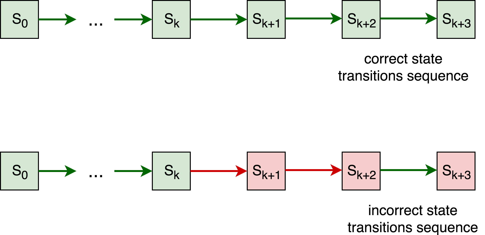
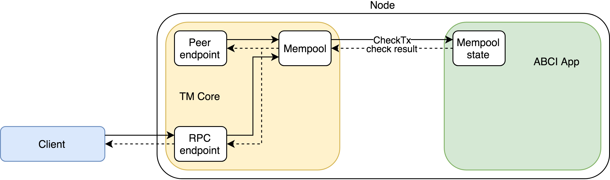
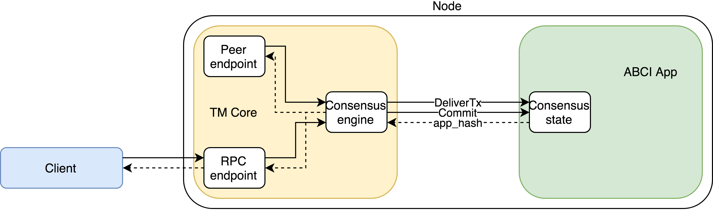
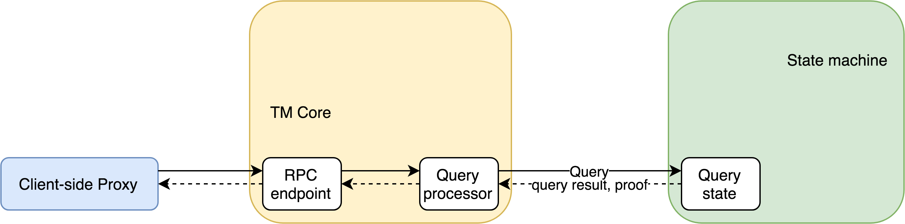

# Tendermint Verifiable Computations and Storage Demo

This demo application shows how verifiable computations might be processed by a distributed cluster of nodes. It comes with a set of hardcoded operations that can be invoked by the client. Each requested operation is computed by every (ignoring failures or Byzantine cases) cluster node, and if any node disagrees with the computation outcome it can submit a dispute to an external Judge.

Results of each computation are stored on the cluster nodes and can be later on retrieved by the client. The storage of the results is secured with Merkle proofs, so malicious nodes can't substitute them with bogus data.

Because every computation is verified by the cluster nodes and computation outcomes are verified using Merkle proofs, the client normally doesn't have to interact with the entire cluster. Moreover, the client can interact with as little as a single node – this won't change safety properties. However, liveness might be compromised – for example, if the node the client is interacting with is silently dropping incoming requests.


## Table of contents
* [Motivation](#motivation)
* [Architecture overview](#architecture-overview)
	* [Tendermint](#tendermint)
	* [State machine and computations correctness](#state-machine-and-computations-correctness)
* [Operations](#operations)
	* [Operations, transactions, and state](#operations-transactions-and-state)
	* [Blocks and transactions](#blocks-and-transactions)
	* [Operations' verification](#operations-verification)
* [Installation and run](#installation-and-run)
* [Sending queries](#sending-queries)
	* [Writing operations (`put`)](#writing-operations-put)
	* [Simple queries (`get`, `ls`)](#simple-queries-get-ls)
	* [Computations without target key (`run`)](#computations-without-target-key-run)
	* [Operation verbose mode and proofs](#operation-verbose-mode-and-proofs)
* [Implementation details](#implementation-details)
	* [Operation processing in the cluster](#operation-processing-in-the-cluster)
	* [Transaction processing on the single node](#transaction-processing-on-the-single-node)
	* [ABCI query processing on the single node](#abci-query-processing-on-the-single-node)
	* [Client implementation details](#client-implementation-details)
	* [Transactions and Merkle hashes](#transactions-and-merkle-hashes)
* [Incorrect behavior of the cluster nodes](#incorrect-behavior-of-the-cluster-nodes)
	* [A. Cases which the client can detect and handle](#a-cases-which-the-client-can-detect-and-handle)
	* [B. Cases which the client can detect, but cannot handle](#b-cases-which-the-client-can-detect-but-cannot-handle)
	* [C. Dispute cases](#c-dispute-cases)
		* [C1: some nodes honest, some not, no quorum](#dispute-case-c1-some-nodes-honest-some-not-no-quorum)
		* [C2: dishonest quorum, minority of honest nodes](#dispute-case-c2-dishonest-quorum-minority-of-honest-nodes)
		* [C3: honest quorum, some nodes dishonest or not available](#dispute-case-c3-honest-quorum-some-nodes-dishonest-or-not-available)

## Motivation
The application is a proof-of-concept of a decentralized system with the following properties:
* Support of arbitrary deterministic operations: simple reads or writes as well as complex computations.
* Total safety of operations when more than 2/3 of the cluster is non-Byzantine.
* Ability to notice and dispute an incorrect behavior when there is at least one non-Byzantine node.
* High availability: tolerance to simultaneous failures or Byzantine actions of some subset of nodes.
* High throughput (up to 1000 transactions per second) and low latency (&#126;1-2 seconds) of operations.
* Reasonable blockchain finality time (few seconds).

## Architecture overview
There are following actors in the application network:

* Cluster **nodes** which carry certain *state* and can run computations over it following requests sent by the client. All nodes normally have an identical state – the only exception is when some node is faulty, acting maliciously or has network issues. Computations can be *effectful* – which means they can change the state.

  When the cluster has reached *consensus* on the computation outcome, the new state can be queried by the client – any up-to-date node can serve it. Consensus requires a 2/3 majority of the nodes to agree to avoid Byzantine nodes sneaking in incorrect results.

* The **client** which can issue simple requests like `put` or `get` to update the cluster state as well as run complex computations. In this demo application an available computations set is limited to operations like `sum` or `factorial` but in principle can be extended by a developer.

  The client is able to check whether the cluster has reached consensus over computation outcomes by checking cluster nodes signatures and validate responses to the queries using Merkle proofs. This means that unless the cluster is taken over by Byzantine nodes the client can be certain about results provided and in general about the cluster state.

* The **Judge** which is in charge of resolving disputes over computations outcomes. Different nodes in the cluster might have different opinions on how their state should change when the computation is performed. Unless there is an unanimous consensus, any disagreeing node can escalate to the **Judge** for the final determination and penalization of uncomplying nodes.

  The **Judge** is not represented by a single machine – actually, it can be as large as Ethereum blockchain to have the desired trustworthiness properties. For this showcase, however, it is imitated as a single process stub which can only notify the user if there is any disagreement.

Two major logical parts can be marked out in the demo application. One is a BFT consensus engine with a replicated transaction log which is provided by the Tendermint platform. Another is a state machine with domain-specific state transitions induced by transactions. We will discuss both parts in more details below.


### Tendermint

[Tendermint](https://github.com/tendermint/tendermint) platform provides a Byzantine-resistant consensus engine (TM Core) which consists of the following parts:
* distributed transaction cache (**mempool**)
* blockchain to store transactions
* Byzantine-resistant **Consensus** module (to reach agreement about the order of transactions)
* peer-to-peer layer to communicate with other nodes
* **RPC endpoint** for client requests
* **Query processor** for making requests to the state

To execute domain-specific logic the application uses its own **State machine** implementing Tendermint's [ABCI interface](http://tendermint.readthedocs.io/projects/tools/en/master/abci-spec.html) to follow Tendermint's architecture. It is written in Scala 2.12, compatible with `Tendermint v0.19.x` and uses `com.github.jtendermint.jabci` for Java ABCI definitions.

### State machine and computations correctness

Each node carries a state which is updated using transactions furnished through the consensus engine. Assuming that more than 2/3 of the cluster nodes are honest, the BFT consensus engine guarantees _correctness_ of state transitions. In other words, unless 1/3 or more of the cluster nodes are Byzantine there is no way the cluster will allow an incorrect transition. 

If every transition made since the genesis was correct, we can expect that the state itself is correct too. Results obtained by querying such a state should be correct as well (assuming a state is a verifiable data structure).



However, it's not possible to expect that a cluster can't be taken over by Byzantine nodes. Let's assume that `n` nodes in the cluster were independently sampled from a large enough pool of the nodes containing a fraction of `q` Byzantine nodes. In this case the number of Byzantine nodes in the cluster (denoted by `X`) approximately follows a Binomial distribution `B(n, q)`. The probability of the cluster failing BFT assumptions is `Pr(X >= ceil(1/3 * n))` which for 10 cluster nodes and 20% of Byzantine nodes in the network pool is `~0.1`.

This a pretty high probability, and if we want to keep the cluster size reasonably low to have desired cost efficiency another trick should work. We can allow any node in the cluster to escalate to the external trusted **Judge** if it disagrees with state transitions made by the rest of the nodes. In this case, all nodes in the cluster need to be Byzantine to keep the **Judge** uninformed. For the considered case the probability of such event is `~1E-7`.

This way it's possible to improve the probability of noticing an incorrect behavior almost by six orders of magnitude. However, there is a significant difference between the two approaches. Once the cluster has reached consensus, the state transition is made and potentially incorrect results can be immediately used by the client. An escalation mechanism allows to notice an incorrect cluster behavior only _post factum_.

To compensate, a **Judge** can penalize malicious nodes by forfeiting their security deposits for the benefit of the client. However, even in this case a client can't be a mission critical application where no amount of compensation would offset the damage made.

The **State machine** maintains its state using in-memory key-value string storage. Keys here are hierarchical, `/`-separated. This key tree is *merkelized*, so for every key the hash of its associated value (if present) and its children keys is also stored.


## Operations
This App uses `query.py` script as the **Client** to request arbitrary operations from the cluster, including:
* `put` requests which specify a target key and a constant as its new value: `put a/b=10`.
* `get` requests to read the value of specified key: `get a/b`.
* Requests to obtain a result of running an arbitrary function with arguments: `run factorial(a/b)`, `run sum(a/b,a/c)`.
* Computational `put` requests which specify that the result a of function invocation should be assigned to a target key: `put a/c=factorial(a/b)`.

### Operations, transactions, and state
`put` operations are *effectful* and change the application state explicitly. They are implemented via Tendermint **transactions**. **TM Core** sends a transaction to the State machine and the **State machine** applies this transaction to its state, typically changing the associated value of the target key.

`get` operations do not change the state of the application. They are implemented via Tendermint **ABCI queries**. As the result of such query the State machine returns the value of the requested key.

`run` operations are also *effectul* and their invocation changes the state. They are implemented as combinations of `put` and `get` requests: to perform such operation trustfully, the **Client** first requests `put`-ting the result of the requested function to some key and then queries its value. 

### Blocks and transactions
**Tendermint Core** orders incoming transactions, passes them to the App and stores them persistently. It also combines transactions into **blocks**. So the blockchain is the ordered sequence of blocks whereas the block contains the ordered sequence of transactions. Beside the transaction list, a block also has some [metadata](http://tendermint.readthedocs.io/en/master/specification/block-structure.html) that help to provide integrity and verifiability guarantees. Basically, this metadata include:
* metadata related to the current block
	* `height` – the index of this block in the blockchain
	* the block creation time
	* hash of the transaction list in the block
	* hash of the previous block
* metadata related to the previous block
	* `app_hash` – the hash of the App state obtained from the State machine at the end of the previous block
	* information about a *voting process* for the previous block


For every block, a single TM Core, the block **proposer**, is chosen. The proposer composes the transaction list, prepares the metadata and initiates the [voting process](http://tendermint.readthedocs.io/en/master/introduction.html#consensus-overview). Then other TM Cores make votes, accepting or declining the proposed block, and sign them. If enough amount of accepting votes exists (a **quorum**, more than 2/3 of TM Cores in the cluster), the block is considered committed. At this time every TM Core requests the local State machine to apply block transactions to the state (in their order) and asks the State machine for `app_hash`. If for some reasons a quorum is not reached (an invalid proposer, a proposal containing wrong hashes, timed out voting, etc.), the proposer is changed and a new attempt (**round**) of block creation (for the same `height` as the previous attempt) is started.

Note that the information about a voting process and `app_hash` is not stored in the current block, because this part of metadata is not known to proposer at time of block creation and becomes available only after successful voting. That's why `app_hash` and voting information for the current block are stored in the next block (and become available outside TM Core only upon the next block commit).

Blocks play the key role in the App (as well as in any application using the blockchain approach) because:
* Grouping transactions together dramatically improves the distributed system performance by reducing the storage and computational overhead per transaction: all metadata are associated with blocks and all nodes' hashes and signatures are applied to blocks. Transactions are just stored inside blocks.
* Block `height` is a primary identifier of a specific state version. All non-transactional queries to the State machine (like `get` operations) should refer to a particular `height`.
* Blocks can be empty i. e. contain no transactions. By committing empty blocks, the TM Core might maintain the freshness of the state without creating new transactions and burdening the State machine.

At the `height`-th block commit, only the presence and the order of its transactions is verified, but not the state upon their executing by the State machine. As the `height`-th block's `app_hash` only available when the `height+1`-th block committed, to verify some transaction from the `height`-th block or query to the `height`-th block the client needs to wait for `height+1`-th block. That's why TM Core always starts making the next block a short time after the previous block' commit, this next block might be empty in case no transactions are available.

### Operations' verification
Reading and writing operations use different techniques to prove to the client that the operation is actually invoked and its result is correct. 

Reading `get` operation takes advantage of *merkelized* structure of the application state and provides Merkle proof of the result correctness. Client has all information to match the query result and the Merkle proof of this result with `app_hash` for the queried state. The Merkle proof of a target key in the hierarchical key tree is the sequence of Merkle hashes of all keys and values along the way from the tree root to the target key.

Any `put` or `run` invocation leads to adding the corresponding transaction to the blockchain. The presence of this transaction in a correctly formed block (and also confirmed by the undisputed `app_hash` in the next block) means that there is a quorum in the cluster regarding this transaction. Later the operation's target key requested and its value together with Merkle proof verifies operation's correctness.

## Installation and run
To run the App, a **Node** machine needs:
* Scala 2.12 with `sbt`
* [Tendermint](http://tendermint.readthedocs.io/en/master/install.html)
* GNU `screen` (to run single-machine cluster)

To send queries, a Client machine needs:
* Python 2.7 with `sha3` package installed

There are scripts that automate deployment and running 4 Application nodes on the local machine.

```bash
source local-cluster-init.sh
```
`local-cluster-init.sh` prepares all required configuration files to launch 4-node cluster locally.

```bash
./local-cluster-start.sh
```
`local-cluster-start.sh` starts 8 screen instances (`app[1-4]` instances for the Apps and `tm[1-4]` – for corresponding TM Cores). Cluster initialization may take some seconds, after that the client can query TM Cores' RPC endpoints on any of `46158`, `46258`, `46358` or `46458` ports.

Other scripts allow to temporarily stop (`local-cluster-stop.sh`), delete (`local-cluster-delete.sh`) and reinitialize/rerun (`local-cluster-reset.sh`) the cluster.

## Sending queries
Examples below use `localhost:46157` to query TM Core on 1st local "node", to access other nodes one needs to use other endpoints (`46257`, `46357`, `46457`). In normal conditions, all endpoints behave the same way.

### Writing operations (`put`)
To set a new key-value mapping, use:
```bash
> python query.py localhost:46157 put a/b=10
RESULT: 10
OK
```
This creates hierarchical key `a/b` (if necessary) and maps it to `10`.

`copy` operation allows to assign a value from one key to another:
```bash
> python query.py localhost:46157 put "a/c=copy(a/b)"
RESULT: 10
OK
```

Submitting an `increment` operation increments the referenced key value and copies the old referenced key value to target key:
```bash
> python query.py localhost:46157 put "a/d=increment(a/c)"
RESULT: 10
OK
```

`sum` operation sums the values of references keys and assigns the result to the target key:
```bash
> python query.py localhost:46157 put "a/e=sum(a/c,a/d)"
RESULT: 23
OK
```

`factorial` operation calculates the factorial of the referenced key value:
```bash
> python query.py localhost:46157 put "a/f=factorial(a/b)"
RESULT: 3628800
OK
```

`hiersum` operation calculates the sum of non-empty values for the referenced key and its descendants by hierarchy (all non-empty values should be integer):
```bash
> python query.py localhost:46157 put "c/asum=hiersum(a)"
RESULT: 3628856
OK
```

### Simple queries (`get`, `ls`)
`get` reads value associated with the argument:
```bash
> python query.py localhost:46157 get a/e
RESULT: 23
OK
```

Another non-changing request, `ls`, can be used to obtain argument key's immediate children list:
```bash
> python query.py localhost:46157 ls a
...
RESULT: e f b c d
OK
```

### Computations without target key (`run`)
Below is the example (note that no target key specified here):
```bash
> python query.py localhost:46157 run "factorial(a/b)"
RESULT: 3628800
OK
```

### Operation verbose mode and proofs
Now let's examine operations output in verbose mode. It allows to trace information about the blockchain structure and verifications.

Observe the output of `put` operation with `-v` option:
```bash
> python query.py localhost:46157 -v put c/a=20
HEIGHT: 21
HASH  : 8FA7A9819479B06B49F7DE770764F353F7492545D182FD9A8F4C4732EC1FC824
PROOF : A7FFC6F8BF1ED76651C14756A061D662F580FF4DE43B49FA82D80A4B80F8434A 80084BF2FBA02475726FEB2CAB2D8215EAB14BC6BDD8BFB2C8151257032ECD8B 1AE35FBEE05908B77FD671B72B9ED97EC0CCA38854C36A0DC11237D1CC14775F 263AB762270D3B73D3E2CDDF9ACC893BB6BD41110347E5D5E4BD1D3C128EA90A 54FC165745C948BC81F0CB5CC2EAA79A79958AEA184DEAA68060B2F0F3A87AB8 B039179A8A4CE2C252AA6F2F25798251C19B75FC1508D9D511A191E0487D64A7 F753E72D15B4EE70BF6575133C942C3C54D21BA288724A20B971E14DCE2896BC, A7FFC6F8BF1ED76651C14756A061D662F580FF4DE43B49FA82D80A4B80F8434A FEFFF5A5B4C68C7D38DD798B3B58397715EF9E8DB3D13612AC9BC184428E2C0D 8BC5A8D386A05349BB228658D6130F0B88D5F9EC9E86537801377C772AF2C97D 830A839A7E420DC5569E44EBF6881D78A48FF578F9120E91059CFE511B616480 F5BF8CF5F2D84AC23EF8138DE74B2B80F12397A7AB4772257EB9A635BF52C6A2 80084BF2FBA02475726FEB2CAB2D8215EAB14BC6BDD8BFB2C8151257032ECD8B 6FC7F9BF495BA41E1AD304EAB525EF1201623D642E54C547C64855BBFA99FED2, F4E39327CB811E8EA6AE4C9E5FA9CA7A8BFB16E5BD8D89D1A7C7CBD80190AD61
RESULT: 20
OK
```

`HEIGHT` corresponds to height of block in which the writing transaction eventually included. `HASH` is `app_hash` of `HEIGHT`-th block. `PROOF` is comma-separated list of Merkle hash from the root key to the target key.

The blockchain contents can be viewed by running a dedicated command:
```bash
> python parse_chain.py localhost:46157
height                 block time     txs acc.txs app_hash                            tx1
...
   20: 2018-06-19 20:43:30.943104       0       9 0x49C941
   21: 2018-06-19 20:45:28.161980       1      10 0x49C941                         c/a=20
   22: 2018-06-19 20:45:29.478594       0      10 0x8FA7A9
```
This command outputs the latest blocks in the blockchain with a short summary about transactions. Here one can ensure that the provided transaction `c/a=20` indeed included in the block with `height` from the response. This fact verifies that Tendermint majority (more than 2/3 of configured validator nodes) agreed on including this transaction in the mentioned block which certified by their signatures.

The output of `parse_chain.py` also shows that the Tendermint blockchain stores `app_hash` from the block not in this block itself, but in the *next* block. For example, compare `HEIGHT` (`21`) and `HASH` (`0x8FA7A9`) from the previous query with `parse_chain` summary for 21st and 22nd blocks. Also note that `app_hash` is not changed after empty block's commit as expected, because empty blocks do not change the App state.

## Implementation details

### Operation processing in the cluster
To initiate an operation the Client needs to connect only a single node of the cluster in normal conditions.

Reading `get` requests are processed on a single node entirely. The node State machine has all required information to process such query because the state with key-value tree and their proofs is fully replicated. The node TM Core also has everything to process `get` query because the blockchain is also fully replicated and contains all information not only about blocks but also about the blocks signatures of other nodes and therefore can prove to the client that the provided response is consistent with those nodes signed the blockchain data.

Writing `run` and `put` requests implemented via Tendermint transactions, so a cluster-wide interaction is required in order to:
* TM Core spreads the transaction to other nodes.
* TM Cores reach consensus about including this transaction in a particular block.
* TM Cores request their local State machine to apply this transaction to the state.
* TM Cores obtain the `app_hash` from their local State machines.

### Transaction processing on the single node
A single transaction is processing primarily by 2 TM Core modules: **Mempool** and **Consensus**.

A transaction appears in Mempool after one of TM Core [RPC](https://tendermint.readthedocs.io/projects/tools/en/master/specification/rpc.html) `broadcast` method invoked. Mempool then invokes the State machine `CheckTx` ABCI method. The State machine might reject the transaction if it is invalid, in this case, the node does not need to connect other nodes and the rejected transaction removed. Otherwise, the transaction starts spreading through other nodes.


The transaction remains some time in Mempool until **Consensus** module of the current TM **proposer** consumes it, includes to the newly created block (possibly together with other transactions) and initiates the voting process for this **proposal** block. If the transaction rate is intensive enough or even exceed the node throughput, it is possible that the transaction may 'wait' during several block formation before it is eventually consumed by proposer's Consensus. *Note that the transaction broadcast and the block proposal are processed independently, it is possible but not required that the proposer is the node initially processed the broadcast.*

If more than 2/3 of the nodes voted for the proposal in a timely manner, the voting process ends successfully. In this case, every TM Core starts the block synchronization with its local State machine. During this phase, the proposer and other nodes behave the same way. TM Core consecutively invokes the State machine's ABCI methods: `BeginBlock`, `DeliverTx` (for each transaction), `EndBlock`, and `Commit`. The State machine applies the block's transactions from `DeliverTx` sequence in their order, calculates the new `app_hash` and returns it to TM Core. At that moment the current block processing ends and the block becomes available outside (via RPC methods like `block` and `blockchain`). TM Core keeps `app_hash` and the information about a voting process for including in the next block's metadata.


### ABCI query processing on the single node
ABCI queries that serve non-changing operations are described by the target key and the target `height`. They are initially processed by TM Core's **Query processor** which reroutes them to the State machine.

The State machine processed the query by looking up for the target key in a state corresponding to the `height`-th block. So the State machine maintains several Query states to be able to process different target heights.


Note that the State machine handles Mempool (`CheckTx`), Consensus (`DeliverTx`, `Commit`) and Query request pipelines concurrently. Also, it maintains separate states for those pipelines, so none of the *Query* states might be affected by 'real-time' *Consensus* state which is possibly modified by delivered transactions at the same time. This design, together with making the target height explicit, allows to isolate different states and avoid race conditions between transactions and queries.

### Client implementation details
To make a reading (`get`) request, the Client first gets the latest verifiable `height` and its `app_hash` from the blockchain RPC. This is the last but one `height` (because the latest one could never be verifiable, its `app_hash` is not available). Then a single ABCI Query call with the `get` target key and the latest verifiable `height` is enough to get the required value together with Merkle proof and check that the value and the proof are consistent with `app_hash`.

To make a writing (`put`) requests, the Client broadcasts the transaction to the cluster. Upon successful broadcast and insertion of the transaction into some block, the Client knows the corresponding block `height`. This `height` becomes verifiable as soon as the next block is committed (as mentioned earlier normally this happens in a short time, by default 1 second at most). Then to verify successful `put` (and to get computation result in case of the computational `put`), the Client just needs to make the ABCI Query with the target key and `height`, like it is described in the previous paragraph for the `get` request.

`run` requests processing is very similar to `put` processing. The only difference that the Client generates a 'hidden' target key and use it to invoke the calculation via Tendermint transaction and then to read it via ABCI Query.

### Transactions and Merkle hashes
The State machine does not recalculate Merkle hashes during `DeliverTx` processing. In case block consists of several transactions, the State machine modifies key tree and marks changed paths by clearing Merkle hashes until ABCI `Commit` processing.


On `Commit` the State machine recalculates Merkle hash along changed paths only. Finally, the app returns the resulting root Merkle hash to TM Core and this hash is stored as `app_hash` for a corresponding block.


Note that described merkelized structure is just for demo purposes and not self-balanced, it remains efficient only until it the user transactions keep it relatively balanced. Something like [Patricia tree](https://github.com/ethereum/wiki/wiki/Patricia-Tree) should be more appropriate to achieve self-balancing.

## Incorrect behavior of the cluster nodes
As any viable distributed system, this Application is designed to handle incorrect or even malicious behavior of the cluster nodes. To avoid the over-complication the following statements considered:
* The Client is correct.
* The Judge is correct. This might look as a serious limitation *but using some highly trusted source like Ethereum smart contract as the Judge in the real life scenario might be a valid solution.* This App implements the Judge as a very simple program just for demo purposes.
* The nodes' public keys are known to all cluster participants.
* The set of nodes in the cluster is immutable. A mutable node set might be handled too, but this is out of the scope of this demo Application.
* At least one cluster node is correct (both the node's TM Core and the State machine are correct). *If the cluster size if large enough (20 and more nodes), the probability of such condition might be very high.*
* The correct nodes can communicate with the client and the Judge.
* It is needless to consider situations when some nodes are partly correct (correct TM Core and incorrect State machine or vice versa).

### A. Cases which the client can detect and handle
1. The node is not available or RPC request to the node is timed out. In this case the Client just retries request to another node, its possible that the rest of nodes is enough to have a quorum and keep the App alive.
2. The TM Core blockchain RPCs (`block`, `blockchain`) return response with inconsistent information: falsified transactions in the blocks, incorrect block hashes, incorrect vote signatures or signatures that are not matched with known public keys. In this case, the Client treats the node as incorrect (possibly Byzantine) and retries request to another node.
3. The TM Core ABCI Query returns wrong result/proof combination (inconsistent with the target height's `app_hash`). Like for Case 2, in this case, the Client treats the node as incorrect (possibly Byzantine) and retries request to another node.
4. The TM Core blockchain RPCs return stale data. The Client expects some maximum time between the blocks, so observing the larger time since the latest block is the reason to retry the request to another node. Note that the current node cannot be considered Byzantine for sure because it might experience connection problems with the rest of the cluster.

### B. Cases which the client can detect, but cannot handle
After detecting those cases the Client is sure that the cluster **liveness** is violated. An external interference is required to restore it.
1. The Client retried the request for cases A1-A4 for all cluster nodes and they all are failed.
2. The cluster cannot commit `height+1`-th block while the Client waits for it to have `height`-th block verifiable. This is actually a subcase of the previous case, but it appears if the cluster recently committed `height`-th block during `put` or `run` processing. The failure to progress in this case probably means that the nodes have different `app_hash`-es for `height`-th block, so this is likely an evidence of the **dispute** in the cluster.

### C. Dispute cases
Dispute cases, in general, cannot be detected by the client, because the client is normally satisfied by the first successful response while retrying response to the cluster nodes. The external Judge is available to the correct nodes in order to prevent such situations (instead of multicasting the client requests to all cluster nodes and comparing the responses).

Another, even more important, reason is that the dispute case might violate the cluster **safety**! When there is a *Byzantine quorum*, Byzantine nodes might provide to the client as wrong responses as they want, but the client keeps trusting the cluster because no Cases B and even Cases A evidence is observed. So the external Judge should also be able to replay the computations that caused the dispute.

#### Dispute case C1: some nodes honest, some not, no quorum
When the last block is `height`-th and there is no quorum (neither honest nor Byzantine) for `height+1`-th block's voting, liveness is violated and new blocks cannot be formed. Such situation might happen if the cluster cannot reach an agreement about next block. Even if TM Core works as expected, different State machines on different nodes might provide to local TM Cores different app hashes for `height`-th block. As already said, Case B2 is usually an aftermath of this case.

To simulate disputes in the local cluster the special key `wrong` might be used. If some node's State machine (indexed 1 to 4 which corresponds to their ports `46158`, `46258`, `46358`, `46458`) get `put` request targeted to `wrong` and a provided value contains node's index, it prepends a prefix `wrong` to this value. For example, after `put wrong=13` request, the 2nd and 4th nodes map `wrong` to `13`, but 1st and 2rd nodes map it to `wrong13`. Consequently, those 'wrong' nodes obtain 'wrong' `app_hash` which disputes with correct `app_hash`. 

This convention works well to illustrate Dispute case C1. First, let's try using `fastput`, an unchecked alternative to `put` (it does not wait for the next block with the current block's `app_hash`) to submit new `wrong` value:
```bash
> python query.py localhost:46157 fastput -v wrong=34
HEIGHT: 3
INFO:   34
OK
```
This invocation return info `34` and `OK` status. At first glance, everything is well because `height`-th (the 3rd actually) block formed and `INFO` equal to new value `34` got. However, this `INFO` should be considered as *tentative* because despite successful the 3rd block formation it's needed to wait for the 4th block that should contain `app_hash` for 3rd block. Note that the source of `INFO` is just output of `DeliverTx` from single App and this output is neither merkelized nor signed by other nodes.

Now the blockchain has inconsistent state. Let's reset it via `local-cluster-reset.sh`, wait some time for cluster initialization and instead of unchecked `fastput` use checked `put`:
```bash
> python query.py localhost:46157 put -v wrong=34
HEIGHT: 3
HASH  : NOT_READY
PROOF : NO_PROOF
RESULT: EMPTY
BAD   : Cannot verify tentative '34'! Height is not verifiable
```
`put` waits for `height+1`-th block before responding. As before, 3rd block formation is successful but it's not enough for `put`, it waits for 4th block. After some timeout, it responds that this block is still not available, so tentative `34` value is not confirmed.

The State machine itself also monitors block creation. By checking it (`screen -x app1`) one can observe the following message in the App's log:
```
NO CLUSTER QUORUM!
```
This message produced by Monitor thread of the App that checks the following condition periodically: if 1 second elapsed from last non-empty block in the blockchain there must be an empty block after that block. Such criterion can also be used to detect such kind of dispute and signal the Judge that cluster needs to be fixed. Of course, the timeout value (default is 1 second) is configurable.

#### Dispute case C2: dishonest quorum, minority of honest nodes
This case can also be illustrated using `wrong` key:
```bash
> python query.py localhost:46157 put -v wrong=234
HEIGHT: 3
HASH  : NOT_READY
PROOF : NO_PROOF
RESULT: EMPTY
BAD   : Cannot verify tentative '234'! Height is not verifiable
```
This message is the same as before but the situation is different actually. All nodes except Node 1 obtain wrong app hash, but now those 'wrong' nodes have a quorum! Therefore the result is not confirmed only from the point of view of Node 1. By checking it's log (`screen -x app1`) another Monitor warning can be observed:
```
DISAGREEMENT WITH CLUSTER QUORUM!
```
To achieve this detection the App's Monitor periodically requests its peer's TM Core RPC's for the next block and compares its own `app_hash` with their `app_hash`-es.

Let's reset the cluster and try again, submit the same transaction, but connect to another node:
```bash
> python query.py localhost:46257 put -v wrong=234
HEIGHT: 3
HASH  : CE773BBAD425FE7C7CA54E890B4E02759564F8E9AB1B82ADCF42437122EDC7CD
PROOF : A7FFC6F8BF1ED76651C14756A061D662F580FF4DE43B49FA82D80A4B80F8434A 1AACEE49E178FF7836873CB0D520C5C7D82B772D28997A0EE51A837A5AA5683C B8366C6DD77D18CCC60B6824C17C9C0B95063213E32AC14D82D2BEE6981EDB87, 3B52405688C482C40A924C5CFC3357BEA000FA2FC149BFCC8020A18EA02BDD92
RESULT: wrong234
OK
```
#### Dispute case C3: honest quorum, some nodes dishonest or not available
When quorum (2/3+ nodes of the cluster) exists availability of other nodes does not influence cluster's safety or liveness. This demo app does not implement any special checks for the existence of nodes absent or Byzantine during operation processing. Let's illustrate this using `wrong` key:
```bash
> python query.py localhost:46157 put -v wrong=4
HEIGHT: 3
HASH  : 7B84...
PROOF : A7FF...
RESULT: 4
OK
```

It's supposed that if some node disagrees with the quorum, it needs to alert itself like for Dispute case C2, so cases C2 and C3 are symmetric in general.
