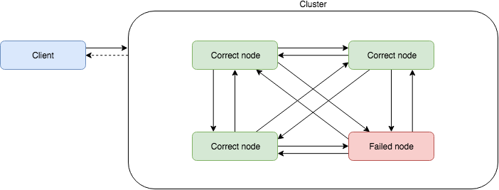
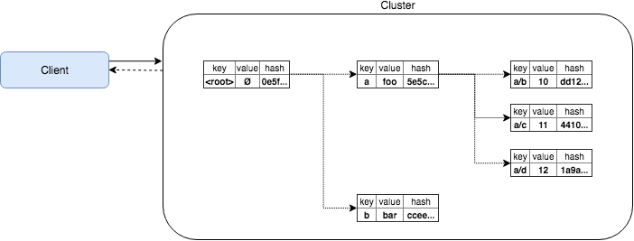
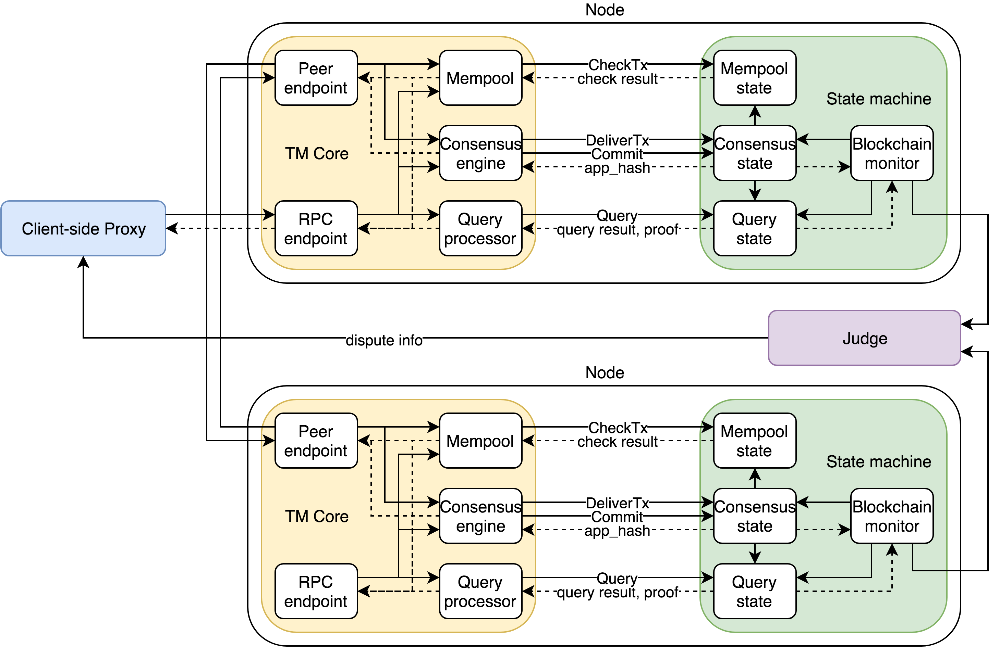
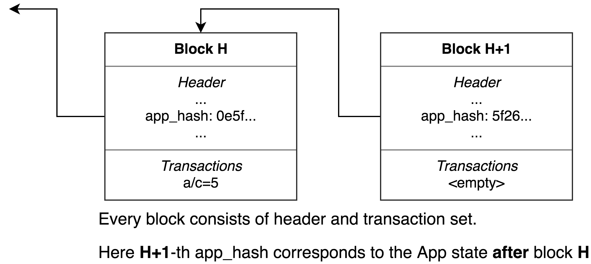
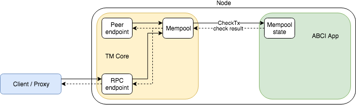
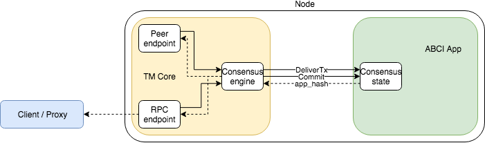
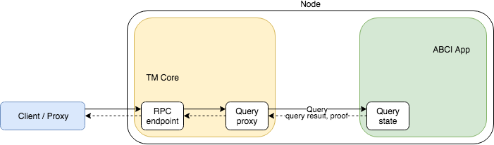
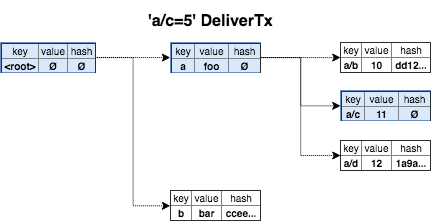
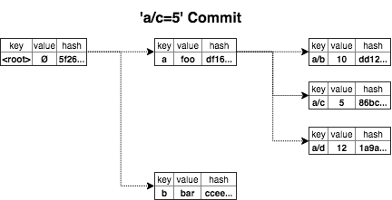

# Tendermint Verifiable Computation and Storage Demo

This demo application shows how verifiable computations might be processed by a distributed cluster of nodes. It comes with a set of hardcoded operations that can be invoked by the client. Each requested operation is computed by every (ignoring failures or Byzantine cases) cluster node, and if any node disagrees with the computation outcome it can submit a dispute to an external Judge.

Results of each computation are stored on the cluster nodes and can be later on retrieved by the client. The storage of the results is secured with Merkle proofs, so malicious nodes can't substitute them with bogus data.

Because every computation is verified by the cluster nodes and computation outcomes are verified using Merkle proofs, the client normally doesn't have to interact with the entire cluster. Moreover, the client can interact with as little as a single node – this won't change safety properties. However, liveness might be compromised – for example if the node the client is interacting with is silently dropping incoming requests.



## Motivation
The application is a proof-of-concept of a system with the following properties:
* Support of arbitrary deterministic operations: simple reads/writes as well as complex and time-consuming calculations
* Having high throughput (1000 transaction per second) and low latency (1-2 seconds) of operations
* Having every operation response verifiable (and thus trusted by the client)
* Ability to restore liveness and even safety after violating typical Byzantine quorum requirements (1/3 of failed nodes and more) – every node could rapidly detect problems in the blockchain or disagreement with the rest of nodes

## Architecture overview
The application use [Tendermint](https://github.com/tendermint/tendermint) platform which provides:
* Distributed transaction cache
* Blockchain (to store transactions persistently)
* Consensus logic (to reach agreement about the order of transactions)
* Peer-to-peer communication layer (between nodes)

The application implements Tendermint's [ABCI interface](http://tendermint.readthedocs.io/projects/tools/en/master/abci-spec.html) to follow Tendermint's architecture which decomposes the application logic into 2 main parts:
* Distributed replicated transaction log (managed by Tendermint)
* And state machine with business logic (manages by the application itself).

The application is written in Scala 2.12. It is compatible with `Tendermint v0.19.x` and uses `com.github.jtendermint.jabci` for Java ABCI definitions.

It models in-memory key-value string storage. Keys here are hierarchical, `/`-separated. This key hierarchy is *merkelized*, so every node stores Merkle hash of its associated value (if present) and its children.



The entire application consists of the following components:
* **Client** proxy (**Proxy**)
* Node Tendermint (**TM** or **TM Core**) with notable modules: Mempool, Consensus and Query
* Node ABCI Application itself (**App** or **ABCI App**)



### Operations
Clients typically interact with Fluence via some local **Proxy**. This Proxy might be implemented in any language (because it communicates with TM Core by queries RPC endpoints), for example, Scala implementation of *some operation* may look like `def doSomeOperation(req: SomeRequest): SomeResponse`. This application uses simple (but powerful) Python `query.sh` script as Proxy to perform arbitrary operations, including:
* Write transactions
`tx a/b=10`
* Key read queries
`get a/b`
* Arbitrary operations
`op factorial:a/b`
* Writing results of arbitrary operations
`tx a/c=factorial:a/b`

In terms of Tendermint architecture, these operations implemented in the following way:
* All writes (simple and containing operations) are Tendermint *transactions*: a transaction changes the application state and stored to the blockchain (the correctness ensured by the consensus).
* Reads are Tendermint *ABCI queries*: they do not change the application state, App just return requested value together with Merkle proof (the correctness ensured by Merkle proof).
* Operations are combinations of writes and reads: to perform operation trustfully, Proxy first requests writing the result of operation to some key and then queries its value (the correctness ensured by both the consensus and Merkle proof).

## Installation and run
For single-node run just launch the application:
```bash
sbt run
```
And launch Tendermint in another terminal:
```bash
# uncomment line below to initialize Tendermint
#tendermint init

# uncomment line below to clear all Tendermint data
#tendermint unsafe_reset_all

tendermint node --consensus.create_empty_blocks=false
```

In case Tendermint launched first, it would periodically try to connect the app until the app started. 

After successful launch the client can communicate with the application via sending RPC calls to TM Core on local `46678` port.

### Cluster
There are scripts that automate deployment and running 4 Application nodes on the local machine.

```bash
source node4-init.sh
```
`node4-init.sh` prepares all required configuration files to launch 4-node cluster locally.

```bash
./node4-start.sh
```
`node4-start.sh` starts 8 screen instances (`app[1-4]` instances for the app and `tm[1-4]` – for TM Core). Cluster initialization may take some seconds, after that the client can query RPC endpoints on any of `46158`, `46258`, `46358` or `46458` ports.

Other scripts allow to temporarily stop (`node4-stop.sh`), delete (`node4-delete.sh`) and reinitialize/rerun (`node4-reset.sh`) the cluster.


## Sending queries

### Transactions
Examples below use `localhost:46157` to query TM Core, for 4-node single-machine cluster requests to other endpoints (`46257`, `46357`, `46457`) behave the same way. For single-node launch (just one TM and one App) the default port is `46657`.

To set a new key-value mapping use:
```bash
python query.py localhost:46157 tx a/b=10
...
OK
HEIGHT: 2
INFO:   10
```
This creates hierarchical key `a/b` (if necessary) and map it to `10`. `HEIGHT` value could be used later to verify the `INFO` by querying the blockchain.

This script outputs the height value corresponding to the provided transaction. The height is available upon executing because `query.py` script uses `broadcast_tx_commit` RPC to send transactions to Tendermint. To query the latest transactions in the blockchain run:
```bash
python parse_chain.py localhost:46157
```
This command outputs last 50 non-empty blocks in the blockchain with a short summary about transactions. Here one can ensure that the provided transaction indeed included in the block with height from the response. This fact verifies that Tendermint majority (more than 2/3 of configured validator nodes) agreed on including this transaction in the mentioned block which certified by their signatures. Signature details (including information about all Consensus rounds and phases) can be found by requesting Tendermint RPC:
```bash
curl -s 'localhost:46157/block?height=_' # replace _ with actual height number
```

`get` transaction allows to copy a value from one key to another:
```bash
python query.py localhost:46157 tx a/c=get:a/b
...
INFO:   10
```

Submitting an `increment` transaction increments the referenced key value and copies the old referenced key value to target key:
```bash
python query.py localhost:46157 tx a/d=increment:a/c
...
INFO:   10
```
To prevent Tendermint from declining transaction that repeats one of the previously applied transactions, it's possible to put any characters after `###` at the end of transaction string, this part of string ignored:
```bash
python query.py localhost:46157 tx a/d=increment:a/c###again
...
INFO:   11
```

`sum` transaction sums the values of references keys and assigns the result to the target key:
```bash
python query.py localhost:46157 tx a/e=sum:a/c,a/d
...
INFO:   23
```

`factorial` transaction calculates the factorial of the referenced key value:
```bash
python query.py localhost:46157 tx a/f=factorial:a/b
...
INFO:   3628800
```

`hiersum` transaction calculates the sum of non-empty values for the referenced key and its descendants by hierarchy (all non-empty values should be integer):
```bash
python query.py localhost:46157 tx c/asum=hiersum:a
...
INFO:   3628856
```

Transactions are not applied in case of wrong arguments (non-integer values to `increment`, `sum`, `factorial` or wrong number of arguments). Transactions with a target key like `get`, `increment`, `sum`, `factorial` return the new value of the target key as `INFO`, but this value is *tentative* cannot be trusted if the serving node is not reliable. To verify the returned `INFO` one needs to `query` the target key explicitly.

### Simple queries
`get` reads values from KVStore:
```bash
python query.py localhost:46157 get a/e
...
RESULT: 23
```
`ls` can be used to obtain requested key's immediate children:
```bash
python query.py localhost:46657 ls a
...
RESULT: e f b c d
```

### Operations
As mentioned above operation query is a combination of subsequent:
* operation processing,
* writing its result to a special key
* and Merkelized read of this key.

Below is the example (note that no target key specified here):
```bash
python query.py localhost:46157 op factorial:a/b
...
RESULT: 3628800
```

## Implementation details
### A. How Proxy sees operation processing
Let's observe how operation processing looks like.
1. Proxy gets `op` from the client.
2. Proxy decomposes operation into 2 interactions with cluster: transaction submit and response query.
3. It takes some state key `opTarget` (it might use different such keys and choose one of them somehow).
4. For transaction submit Proxy:
	* Obtains `opTx` as `<opTarget>=<op>`. The `opTx` binary representation is *transaction* in terms of Tendermint.
	* Queries some TM via RPC call: `http://<node_endpoint>/broadcast_tx_commit?tx=<opTx>`.
	* In case of correct (without error messages and not timed out) TM response it treats `height` from it as `opHeight` and considers transaction committed (but yet not validated) and proceeds to the next step.
5. Proxy check whether `opHeight`-th block contains `opTx` indeed:
	* Queries `http://<node_endpoint>/block?height=<opHeight>`.
	* In case of correct TM response it checks for `opTx` existence in transaction list section of response and checks block signature.
	* Upon leaving this step Proxy is sure that the cluster already performed the operation, committed it to the state, but it has no information about reaching consensus for the operation result.



6. Proxy waits for `opHeight+1`-th block to ensure cluster consensus for resulting app hash:
	* Waits some small time.
	* Starts periodically querying `http://<node_endpoint>/block?height=<opHeight+1>`.
	* Once getting successful response, it checks block signatures.
	* It also get `app_hash` for response (it corresponds to app hash after `height`-th block).
	* Query loop in this step can be replaced with `NewBlock` subscription via WebSocket RPC.
	* Upon leaving this step Proxy is sure that the cluster has already performed the operation, wrote it to `opTarget` and reached consensus about `opTarget` value.
7. Proxy queries `opTarget` value:
	* It makes RPC call for key-value read with explicit height and claim for proof `http://<node_endpoint>/abci_query?height=<opHeight>&prove=true&path=<opTarget>`.
	* It got response containing `value` (interpreted as `opResult`) and `proof`.
	* It checks that `opResult`, `proof` and `app_hash` are consistent with each other.
8. Proxy returns `opResult` to the client.

### B. How Tendermint sees transaction submit
Let's look how Tendermint on some node (say, N) treats transaction submit (step A4) and makes some post-submit checks (A5, A6).
1. TM gets `broadcast_tx_commit` RPC call with `opTx` binary string from Proxy.
2. Mempool processing:
	* TM's RPC endpoint transfers the transaction to TM's *Mempool* module.
	* Mempool invokes local App's `CheckTx` ABCI method. If App might reject the transaction, this information is sent to the client and no further action happens.
	* The transaction gossip begins: the `opTx` starts spreading through other nodes.
	* Also Mempool caches the transaction (in order to not accept repeated broadcasts of `opTx`).

3. Consensus processing:
	* When the current TM *proposer* (this is some cluster node, not N in common case) is ready to create a new block, it grabs some amount of the earliest yet not committed transactions from local Mempool. If the transaction rate is intensive enough or even exceed TM/App throughput, it is possible that `opTx` may 'wait' during several block formation before it would be grabbed by Consensus.
	* As soon as `opTx` and other transactions reach Consensus module, block election starts. Proposer creates block proposal (that describes all transactions in the current block) for current *round*, then other nodes make votes. In order to reach consensus for the block, the election should pass all consensus stages (propose, pre-vote, pre-commit) with the majority of TM votes (more that 2/3 of cluster nodes). If it doesn't work for some reason (votes timeout, Byzantive proposer), proposer changed and a new round starts (possibly with another transaction set for the current block).
4. Post-consensus interaction with the local App:
	* When election successfully passed all stages each correct TM understands that consensus is reached. Then it invokes App's ABCI methods: `BeginBlock`, `DeliverTx` (for each transaction), `EndBlock`, `Commit`.
	* An information from `DeliverTx` call then sent back to Proxy
	* `app_hash` field from `Commit` call is stored by TM before making the next block.

5. The new, `height`-th, block metadata and transaction set now committed and becomes available via RPC's like `block`, `blockchain`, `status` (including call in Step A5). However the recently obtained from App block's app hash yet not stored in the blockchain (because an App hash for some block is stored in the blockchain metadata for the next block).
6. Next block processing:
	* Steps B2-B5 repeated for the next, `height+1`-th block. It may take some time, depending on new transactions availability and rate and commit timeout settings.
	* The consensus for `height+1`-th block is only possible if the majority (more than 2/3 of TM's) agree about `height`-th block app hash. So `app_hash` information in `height+1`-th block header refers to `app_hash` provided on Step B4 for `height`-th block (which is checked on Step A6).

### C. How ABCI App sees transaction submit
Now we dig into details of processing the transaction on App side (on node N).
1. On Step B2 TM asks App via `CheckTx` call. This is lightweight checking that works well if some signification part of transactions might be rejected by App by some reason (for example it becomes inconsistent after applying some recently committed other transaction). This allows avoiding unnecessary transaction gossip and need of permanent storing such incorrect transaction in the blockchain after commit.
	* In case `CheckTx` invoked once but `opTx` is not grabbed by proposer's Consensus module for the next block, `CheckTx` reinvoked for every subsequent block until `opTx` eventually grabbed by proposer (because after some block commit, `opTx` might become incorrect and need to be `CheckTx`-ed).
2. On Step B4 TM invokes App's ABCI `DeliverTx` method.
	* App can reject the transaction (it's OK because lightweight `CheckTx` cannot check any possible failure cases) and avoid to change anything. It this case TM would store the transaction anyway because the block already formed.
	* Normally App applies the transaction to the state. It maintains the 'real-time' state that already applied all previous changes not only from previous blocks' transactions but even for all previous transactions of the current block.
3. On Step B4 TM also invokes App's ABCI `Commit` method that signals that block commit is over. The App must return the actual state hash (*app hash*) as the result. As said before, this app hash would correspond to `height`-th block and be stored in the `height+1`-th block metadata.

Note that to follow Tendermint architecture Step C2 and C3 behavior are purely deterministic. It guarantees in normal (non-Byzantine) case scenario both the same app hash from different nodes and the same app hash from a single node after replaying transactions by TM (for example when node recovers from fail). This determinism includes transaction acceptance status (accepted or rejected), transaction application to the real-time state and app hash computation logic.

### D. How Tendermint sees response query
Response query initiated by Proxy on Step A7. Queries are processed by TM's Query module. Processing is very straightforward: it's just proxying the query to the local App.


### E. How ABCI App sees response query
Query processing on the App performed in the following way:
1. App gets `height`, `prove` flag and `path` from the query.
2. The query should be applied to the state exactly corresponded to `height`-th block (this is not 'real-time' consensus state and in general not 'mempool' state).
	* In case App do not store all block states and `height` is too old, it might reject the query.
	* Otherwise it applies the query to the corresponding state. Queries might be complex enough but not every query might be proved efficiently. Therefore it's expected that queries are relatively simple like specific value's read or hierarchical structure scan.
	* In case of read query on Step A7, App just reads `opTarget` value previously written by applying `opTx` and committed in `height`-th block.
3. If proof flag requested (as on Step A7), App also produce Merkle path (or some other provable information) that supply `opTarget` value verification with respect to given `height` and it's app hash (from `height+1` block metadata)
4. The response containing the value, Merkle proof and any other information sent back to the local TM.

### Transactions and Merkle hashes
Examples above usually demonstrate a single transaction per block or empty blocks. Note that the App does not recalculate Merkle hashes during `DeliverTx` processing. In case of several transactions per block (when massive broadcasting of multiple transactions via `broadcast_tx_sync` or `broadcast_tx_async` RPCs performed), the App modifies key tree and marks changed paths by clearing Merkle hashes until ABCI `Commit` processing.



On `Commit` the App recalculates Merkle hash along changed paths only. Finally, the app returns the resulting root Merkle hash to Tendermint and this hash is stored as `app_hash` for corresponding height in the blockchain.



Note that described merkelized structure is just for demo purposes and not self-balanced, it remains efficient only until it the user transactions keep it relatively balanced. Something like [Patricia tree](https://github.com/ethereum/wiki/wiki/Patricia-Tree) should be more appropriate to achieve self-balancing.

## Dispute cases
The examples below illustrate different situations when cluster's liveness and safety properties are violated. This can be caused not only by Byzantine behavior of nodes but also by some failures or bugs on particular cluster nodes. These examples show that such situations can be efficiently detected while at least one correct node exists. To fix such disputes in the production system, some *Supervisor* side should exist and correct nodes should be able to communicate with it.

### Dispute case 1: some nodes honest, some not, no quorum
When the last block is `height`-th and there is no quorum (neither honest nor Byzantine) for `height+1`-th block's voting, liveness is violated and new blocks cannot be formed. Such situation might happen if the cluster cannot reach an agreement about next block. Even if TM Core works as expected, different Apps on different nodes might provide to local TM's different app hashes for `height`-th block.

To simulate `app_hash` disputes in 4-node cluster the App uses special key `wrong`. Every node's App (indexed 1 to 4 which corresponds to their ports `46158`, `46258`, `46358`, `46458`) interprets any occurrence of its own index in `wrong` value as the flag to provide *wrong* `app_hash` to TM Core. This convention works well to illustrate Dispute case 1. First, let's try using `tx` to submit new `wrong` value:
```bash
python query.py localhost:46157 tx wrong=34
HEIGHT: 3
INFO:   34
OK
```
This invocation return info `34` and `OK` status. At first glance, everything is well because `height`-th (the 3rd actually) block formed and `INFO` equal to new value `34` got. However this `INFO` should be considered as *tentative* because despite successful the 3rd block formation it's needed to wait for the 4th block that should contain `app_hash` for 3rd block. Note that the source of `INFO` is just output of `DeliverTx` from single App and this output is neither merkelized nor signed by other nodes.

Now the blockchain has inconsistent state. Let's reset it via `node4-reset.sh`, wait some time for cluster initialization and use another command, `txverify`:
```bash
python query.py localhost:46157 txverify wrong=34
HEIGHT: 3
BAD   : Cannot verify tentative result '34'!
```
`txverify` waits for `height+1`-th block before responding. This behavior is similar to `op` command logic. As before 3rd block formation is successful but it's not enough for `txverify`, it waits for 4th block. After some timeout, it responds that this block is still not available, so tentative `34` value is not confirmed.

The App itself also monitors block creation. By checking it (`screen -x app1`) one can observe the following message in the App's log:
```
NO CLUSTER QUORUM!
```
This message produced by Monitor thread of the App that checks the following condition periodically: if 1 second elapsed from last non-empty block in the blockchain there must be an empty block after that block. When developing production system such criterion can also be used to detect such kind of dispute and signal the Supervisor that cluster needs to be fixed. Of course, the timeout value (default is 1 second) is configurable.

### Dispute case 2: dishonest quorum, minority of honest nodes
This case can also be illustrated using `wrong` key:
```bash
python query.py localhost:46157 txverify wrong=234
HEIGHT: 3
BAD   : Cannot verify tentative result '234'!
```
This message is the same as before but the situation is different actually. All nodes except Node 1 return wrong app hash to its TM's, but now those 'wrong' nodes have quorum! Therefore the result is not confirmed only from the point of view of Node 1. By checking it's log (`screen -x app1`) another Monitor warning can be observed:
```
DISAGREEMENT WITH CLUSTER QUORUM!
```
To achieve this detection the App's Monitor periodically requests its peer's TM Core RPC's for the next block and compares its own `app_hash` with their `app_hash`-es.

Let's reset the cluster and try again, submit the same transaction, but connect to another node:
```bash
python query.py localhost:46257 txverify wrong=234
HEIGHT: 3
OK
RESULT: 234
PROOF : a7ff...
```
As expected, from the point of view of 'wrong' nodes everything is OK and tentative result is confirmed later by querying `wrong` key with merkelizing explicitly.

This example shows that in presence of dishonest quorum Tendermint safety is violated and the blockchain is in a falsified state. However, for production system, the App's Monitor can efficiently detect such problem and raise the dispute to the Supervisor.

### Dispute case 3: honest quorum, some nodes dishonest or not available
When quorum (2/3+ nodes of the cluster) exists availability of other nodes does not influence cluster's safety or liveness. This demo app does not implement any special checks for the existence of nodes absent or Byzantine during operation processing. Let's illustrate this using `wrong` key:
```bash
python query.py localhost:46157 txverify wrong=4
HEIGHT: 3
OK
RESULT: 4
PROOF : a7ff...
```

It's supposed that if some node disagrees with the quorum, it needs to alert itself like for Dispute case 2, so cases 2 and 3 are symmetric in general.
